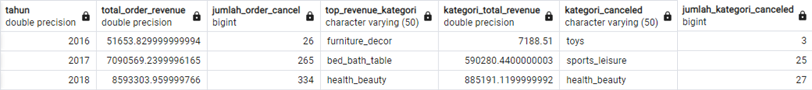

# About the Project
In a company measuring business performance is very important to track, monitor, and assess the success or failure of various business processes. Therefore, this paper will analyze business performance for an eCommerce company, taking into account several business metrics, customer growth, product quality, and payment types.

# Objective
- Create postgreSQL database with avalaible datasets.
    Data were have size more than 120 MB, with database software analysis process will runs much faster. Operation will use database administration tools, Dbeaver.
- Analyze annual customer growth, product quality, and payment types.
    Business focus on this 3 metric to analyze their company. For this analysis we will find insight what happend with this metric along year 2016 to 2018.
- Generate business recommendation.
    Yield actionable recommendation based on insight and analysis process for business to growth in the future.

# Research Question
 - Is there any increase in customer acivity for each year?
 - Does product category have differences for each sub-category revenue for each year?
 - Does electric payment will be favourite customer payment?

# Hypotesis
 - Each year will be different cutomer activity
 - Product category have it's own market and will have different demand each year.
 - Electric payment will have high number of usage because it more easy to use than other method.

# Data and Assumption
 - Data were collected from September 2016 to August 2018.
 - Dataset are 8 csv files.
 
# Analysis
## Customer Annual Activity

2016 having lower values because it is started from september. Average order for each year have no significant different, 1 order per customer. There is monthly active user increase from 2017 to 2018, even 2018 data is just 8 months.

2016 and 2018 repeat order are lower potentialy because of lacks of data. 

## Annual Product Category Quality Analysis

Each year have different top product category it is indicate that annual market are fluctuative. On 2018 we have health beauty product as top revenue and most cancled product, we can take insight that top sold product have high chance to get cancled.

Health beauty product have significant increase starting at early 2018.

## Annual Payment Type Usage

Credit card become the most favorite payment type for customer, poetntialy it is because credit card more handy to use than other payment method.
# Summary
Company have significant growth from 2016 to 2018, proved by monthly active cutomer and repeat order. Product category sold increase from 2016 to 2017 and start flat in 2018 for some category. Health beauty product have significant increaset in 2018 and have high chances still  increasing for next month. Customer keenly pay with credit card, possibly because it is handy to use.

# Recommendation
Launch promotion to buy heath beauty product for new customer and loyal customer with creadit card payment. With this way company can increase this 3 metric, Customer growth, Product quality, and Payment type.